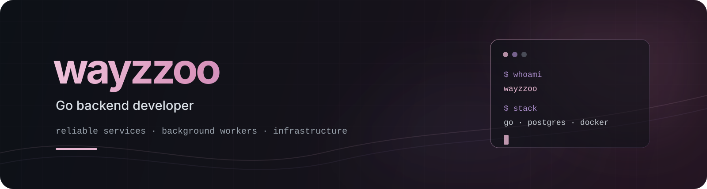

  

   

  

  
  &nbsp;
  
  &nbsp;
  

 

## about

I'm Alex, a backend developer working primarily with **Go**.

I build APIs, background workers and infrastructure-oriented services with
a focus on clear boundaries, predictable behaviour and maintainable code.

I enjoy working with concurrency, PostgreSQL, message queues, networking
and production-oriented testing.

> writing backend code and fixing what I broke yesterday.

 

## currently building

<table>
<tr>
<td width="68%" valign="top">

### [`pulsewarden`](https://github.com/wayzzoo/pulsewarden)

A production-oriented uptime monitoring platform written in Go.

Pulsewarden is designed to monitor HTTP endpoints, APIs and network
services using separate API and worker processes.

Current foundation:

- API and background worker applications
- PostgreSQL repository layer
- Use-case oriented architecture
- Structured logging and request IDs
- Health and readiness endpoints
- Graceful shutdown
- Unit and integration tests
- Race detector and static analysis checks

Current focus: monitor scheduling and check execution.

</td>
<td width="32%" valign="top">

### stack

`Go`

`PostgreSQL`

`REST`

`Background Workers`

`Integration Tests`

`Docker`

</td>
</tr>
</table>

 

## tools I work with

  
  
  
  

  
  
  
  

 

## engineering interests

  <code>Go services</code>
  <code>concurrency</code>
  <code>background workers</code>
  <code>message queues</code>
  <code>networking</code>
  <code>PostgreSQL</code>
  <code>observability</code>
  <code>integration testing</code>

 

## how I approach backend development

<pre lang="go"><code>func buildService() {
    keepInterfacesSmall()
    makeDependenciesExplicit()
    handleShutdownGracefully()
    testBehaviourNotImplementation()
    avoidLeakingGoroutines()
}</code></pre>

 

## selected work

<table>
<tr>
<td width="50%" valign="top">

### [`pulsewarden`](https://github.com/wayzzoo/pulsewarden)

Uptime monitoring platform with separate API and worker services.

`Go` · `PostgreSQL` · `Monitoring`

[open repository →](https://github.com/wayzzoo/pulsewarden)

</td>
<td width="50%" valign="top">

### more projects

Backend, distributed systems and network programming experiments.

`Go` · `Infrastructure` · `Networking`

[view repositories →](https://github.com/wayzzoo?tab=repositories)

</td>
</tr>
</table>

 

## contact

  Open to remote <strong>Go backend</strong> opportunities and meaningful
  open-source collaborations.

  

 

  wayzzoo · Go backend developer

